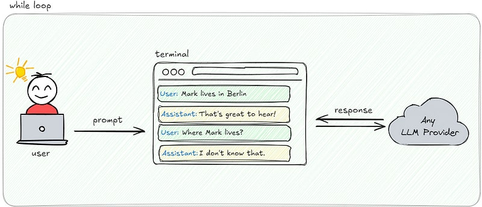
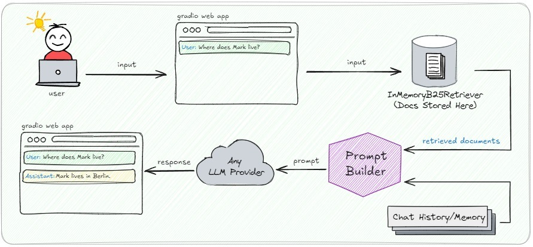

# 5 Levels of Building Chatbot Apps

In this repo, you can find the codes of my article series called "5 Levels of Building Chatbot Apps with Haystack" where in this series we cover starting from an introductory bot and progressing to more complex, context-aware conversational systems. Whether you’re new to chatbot development or looking to refine your expertise, these guides will provide practical insights into leveraging Haystack to create chatbots that can deliver engaging, dynamic interactions with well-designed systems.

**You can access the code for each level by simply switching between branches.**

## Level 1 Chatbot: Not Even a Chatbot!

Walkthrough of Level 1 Chatbot: [Medium Article Link](https://medium.com/@armantunga/5-levels-of-building-chatbot-apps-with-haystack-level-1-d2ef2589715b)

## Level 2 Chatbot: Chatbot with Memory and Retrieval

Walkthrough of Level 2 Chatbot: [Medium Article Link](https://medium.com/@armantunga/5-levels-of-building-chatbot-apps-with-haystack-level-2-437a207ae784)